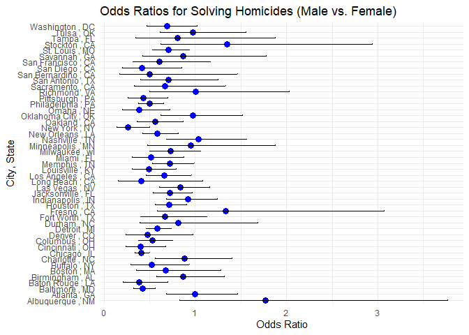
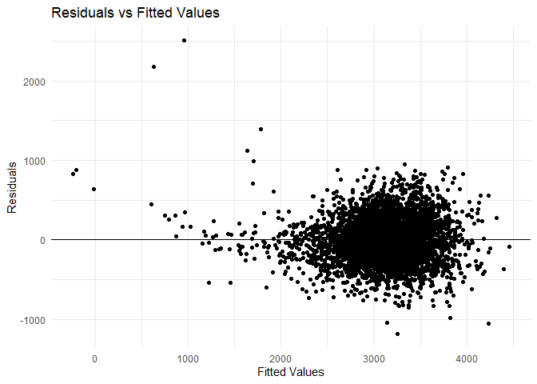
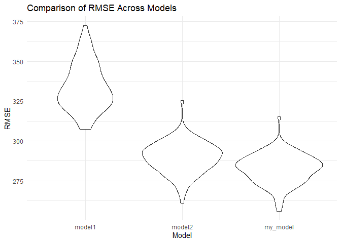

P8105_HW6_LJ2607
================
Li Jiang
2024-12-04

``` r
#Load required packages
library(readr)
library(tidyverse)
```

    ## ── Attaching core tidyverse packages ──────────────────────── tidyverse 2.0.0 ──
    ## ✔ dplyr     1.1.4     ✔ purrr     1.0.2
    ## ✔ forcats   1.0.0     ✔ stringr   1.5.1
    ## ✔ ggplot2   3.5.1     ✔ tibble    3.2.1
    ## ✔ lubridate 1.9.3     ✔ tidyr     1.3.1
    ## ── Conflicts ────────────────────────────────────────── tidyverse_conflicts() ──
    ## ✖ dplyr::filter() masks stats::filter()
    ## ✖ dplyr::lag()    masks stats::lag()
    ## ℹ Use the conflicted package (<http://conflicted.r-lib.org/>) to force all conflicts to become errors

``` r
library(dplyr)
library(purrr)
library(modelr)
library(broom)
```

    ## 
    ## Attaching package: 'broom'
    ## 
    ## The following object is masked from 'package:modelr':
    ## 
    ##     bootstrap

``` r
library(ggplot2)
```

\*Question2

``` r
#Importing dataset
homicide_data <- read_csv("data/homicide-data.csv")
```

    ## Rows: 52179 Columns: 12
    ## ── Column specification ────────────────────────────────────────────────────────
    ## Delimiter: ","
    ## chr (9): uid, victim_last, victim_first, victim_race, victim_age, victim_sex...
    ## dbl (3): reported_date, lat, lon
    ## 
    ## ℹ Use `spec()` to retrieve the full column specification for this data.
    ## ℹ Specify the column types or set `show_col_types = FALSE` to quiet this message.

``` r
View(homicide_data)
```

``` r
#clean dataset and prepare for analysis
homicide_data_clean <- homicide_data %>%
  mutate(
    city_state = paste(city, ",", state),
    victim_age = as.numeric(victim_age),
    homicide_status = ifelse(disposition == "Closed by arrest", 1, 0))%>%
  filter(
    victim_race %in% c("White", "Black"), 
    !city_state %in% c("Dallas,TX", "Phoenix,AZ", "Kansas City,MO", "Tulsa,AL"))%>%
  mutate(
    victim_sex = factor(victim_sex),
    victim_race = factor(victim_race))
```

    ## Warning: There was 1 warning in `mutate()`.
    ## ℹ In argument: `victim_age = as.numeric(victim_age)`.
    ## Caused by warning:
    ## ! NAs introduced by coercion

``` r
#lOgistic regression for city of baltimore
baltimore_data <- homicide_data_clean %>%
  filter(city_state =="Baltimore , MD")

baltimore_model <- glm(
  homicide_status ~ victim_age + victim_sex + victim_race,
  data = baltimore_data,
  family = binomial)
  
baltimore_model %>% 
  broom::tidy() %>% 
  mutate(OR = exp(estimate),  
         conf.low = exp(estimate - 1.96 * std.error), 
         conf.high = exp(estimate + 1.96 * std.error)) %>%  
  filter(term == "victim_sexMale") %>%  
  select(term, OR, conf.low, conf.high) %>%
  knitr::kable()
```

| term           |        OR | conf.low | conf.high |
|:---------------|----------:|---------:|----------:|
| victim_sexMale | 0.4255117 | 0.324559 | 0.5578655 |

``` r
#Remove problematic city_state (Tulsa,AL)
problematic_cities <- homicide_data_clean %>%
  group_by(city_state) %>%
  summarise(
    victim_sex_levels = n_distinct(victim_sex),
    victim_race_levels = n_distinct(victim_race),
    homicide_status_levels = n_distinct(homicide_status)
  ) %>%
  filter(
    victim_sex_levels < 2 | 
    victim_race_levels < 2 | 
    homicide_status_levels < 2
  )

homicide_data_clean <- homicide_data_clean %>%
  filter(!city_state %in% problematic_cities$city_state)

homicide_data_clean <- homicide_data_clean %>%
  mutate(
    victim_sex = factor(victim_sex),
    victim_race = factor(victim_race),
    homicide_status = factor(homicide_status)
  )
```

``` r
#logistic regression for all cities
city_models <- homicide_data_clean %>%
  group_by(city_state) %>%
  nest() %>%
  mutate(
    model = map(data, ~ glm(homicide_status ~ victim_age + victim_sex + victim_race, data = ., family = binomial)),
    results = map(model, ~ broom::tidy(.x) %>%
      mutate(
        OR = exp(estimate),
        conf.low = exp(estimate - 1.96 * std.error),
        conf.high = exp(estimate + 1.96 * std.error)
      ) %>%
      filter(term == "victim_sexMale") %>%
      select(term, OR, conf.low, conf.high))
  ) %>%
  unnest(results) %>%
  select(city_state, OR, conf.low, conf.high)
```

``` r
# Plot the results
city_models %>%
  mutate(city_state = fct_reorder(city_state, OR)) %>%  
  ggplot(aes(x = city_state, y = OR)) +
  geom_point(color = "blue", size = 3) +                
  geom_errorbar(aes(ymin = conf.low, ymax = conf.high), width = 0.2) + 
  coord_flip() +                                      
  labs(
    title = "Odds Ratios for Solving Homicides (Male vs. Female)",
    x = "City, State",
    y = "Odds Ratio"
  ) +
  theme_minimal()
```

<!-- -->
\*Comments:The plot displays the odds ratios and confidence intervals
for each city, categorized by male and female homicide cases. It reveals
that cases involving male victims are generally less likely to be solved
compared to those involving female victims. Notably, the top three
cities—Albuquerque, NM; Stockton, CA; and Fresno, CA—exhibit the highest
odds ratios for male versus female victims compared to other cities.

\*Question3

``` r
#Load datasets
birthweight <- read_csv("data/birthweight.csv")%>%
  drop_na()
```

    ## Rows: 4342 Columns: 20
    ## ── Column specification ────────────────────────────────────────────────────────
    ## Delimiter: ","
    ## dbl (20): babysex, bhead, blength, bwt, delwt, fincome, frace, gaweeks, malf...
    ## 
    ## ℹ Use `spec()` to retrieve the full column specification for this data.
    ## ℹ Specify the column types or set `show_col_types = FALSE` to quiet this message.

``` r
#Fit my own model
birthweight_model <- lm(bwt ~ babysex + bhead + blength + delwt + gaweeks + smoken, data = birthweight)
summary(birthweight_model)
```

    ## 
    ## Call:
    ## lm(formula = bwt ~ babysex + bhead + blength + delwt + gaweeks + 
    ##     smoken, data = birthweight)
    ## 
    ## Residuals:
    ##      Min       1Q   Median       3Q      Max 
    ## -1181.20  -183.63    -9.49   174.43  2506.57 
    ## 
    ## Coefficients:
    ##               Estimate Std. Error t value Pr(>|t|)    
    ## (Intercept) -6316.0766    99.0572 -63.762  < 2e-16 ***
    ## babysex        30.3364     8.7343   3.473 0.000519 ***
    ## bhead         137.1933     3.5353  38.806  < 2e-16 ***
    ## blength        78.8032     2.0720  38.033  < 2e-16 ***
    ## delwt           2.0766     0.1994  10.416  < 2e-16 ***
    ## gaweeks        14.0748     1.4976   9.398  < 2e-16 ***
    ## smoken         -2.1711     0.5823  -3.729 0.000195 ***
    ## ---
    ## Signif. codes:  0 '***' 0.001 '**' 0.01 '*' 0.05 '.' 0.1 ' ' 1
    ## 
    ## Residual standard error: 282 on 4335 degrees of freedom
    ## Multiple R-squared:  0.6973, Adjusted R-squared:  0.6969 
    ## F-statistic:  1665 on 6 and 4335 DF,  p-value: < 2.2e-16

``` r
birthweight <- birthweight %>%
  add_predictions(birthweight_model) %>%
  add_residuals(birthweight_model)

ggplot(birthweight, aes(x = pred, y = resid)) +
  geom_point() +
  geom_hline(yintercept = 0) +
  labs(
    title = "Residuals vs Fitted Values",
    x = "Fitted Values",
    y = "Residuals"
  ) +
  theme_minimal()
```

<!-- -->
\*Modeling process:I aimed to predict birthweight using key predictors
like babysex, bhead, blength, delwt, gaweeks, and smoken. After dropping
missing value, I proposed a linear model as interested. The plot of
model residues against fitted values indicate that the residues are
almost evenly distributed around fitted value.

``` r
#Build two other models
model_simple <- lm(bwt ~ blength + gaweeks, data = birthweight)
model_interaction <- lm(bwt ~ bhead * blength * babysex, data = birthweight)
```

``` r
#Compare my model with other two models
comparision <- crossv_mc(birthweight, 100) %>%
  mutate(
    train = map(train, as_tibble),
    test = map(test, as_tibble)
  ) %>%
  mutate(
    model1 = map(train, ~ lm(bwt ~ blength + gaweeks, data = .x)),
    model2 = map(train, ~ lm(bwt ~ bhead * blength * babysex, data = .x)),
    my_model = map(train, ~ lm(lm(bwt ~ babysex + bhead + blength + delwt + gaweeks + smoken, data = .x)))) %>%
  mutate(
    rmse_model1 = map2_dbl(model1, test, ~ rmse(model = .x, data = .y)),
    rmse_model2 = map2_dbl(model2, test, ~ rmse(model = .x, data = .y)),
    rmse_my_model = map2_dbl(my_model, test, ~ rmse(model = .x, data = .y))
  )
```

``` r
# Compare RMSE for each model
comparision %>%
  select(starts_with("rmse")) %>%
  pivot_longer(everything(), names_to = "model", values_to = "rmse", names_prefix = "rmse_") %>%
  ggplot(aes(x = model, y = rmse)) +
  geom_violin() +
  labs(
    title = "Comparison of RMSE Across Models",
    x = "Model",
    y = "RMSE"
  ) +
  theme_minimal()
```

<!-- -->

\*Conclusion:After comparing RMSE distributions across three models.
Model 1 shows the highest RMSE and widest distribution of RMSE,
indicating the lowest predictive accuracy. Model 2 achieves lower RMSE
with a narrower distribution, reflecting betterperformance. My model has
relatively lower RMSE to Model 2 but with narrower distribution,
suggesting higher performance than model 1 and model 2.
